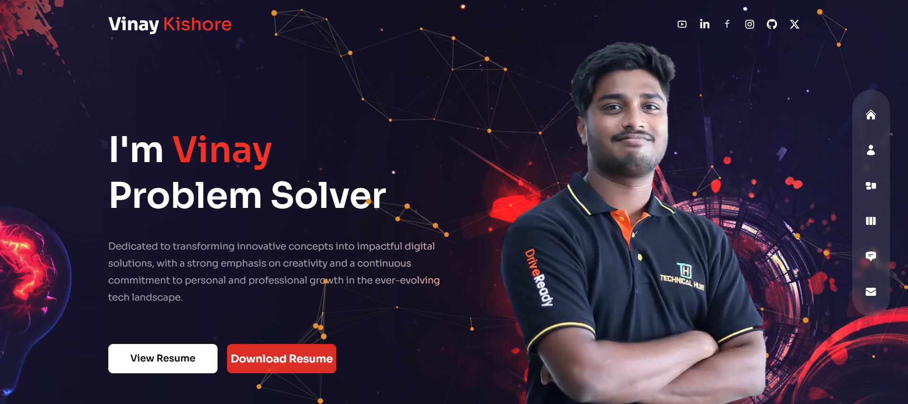
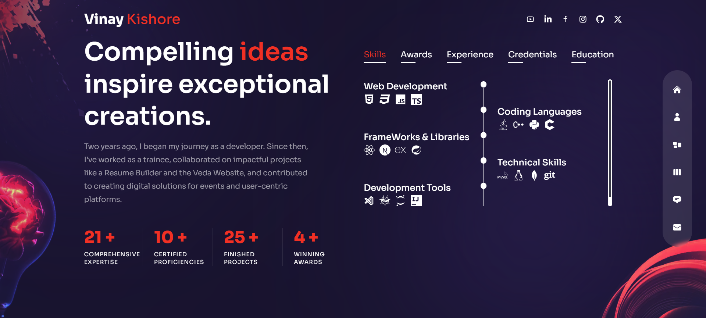
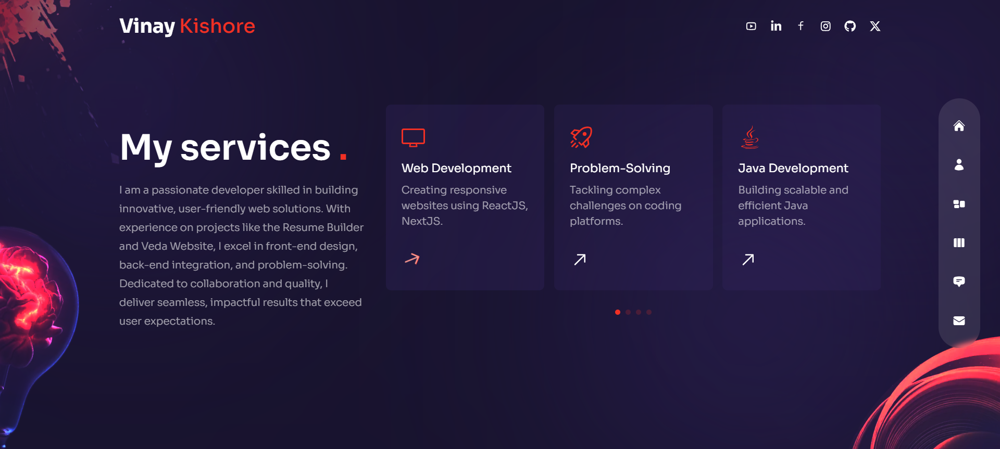
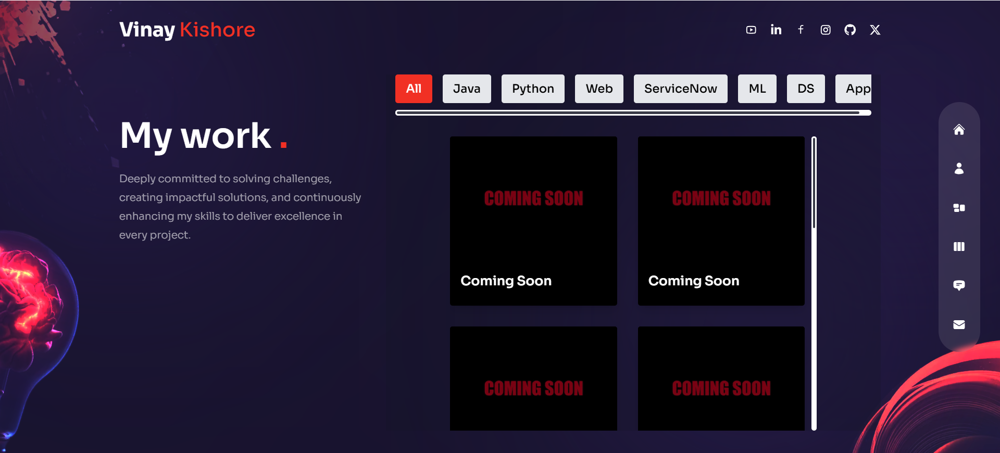
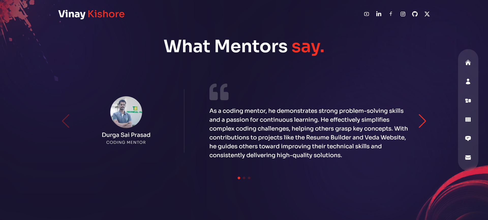
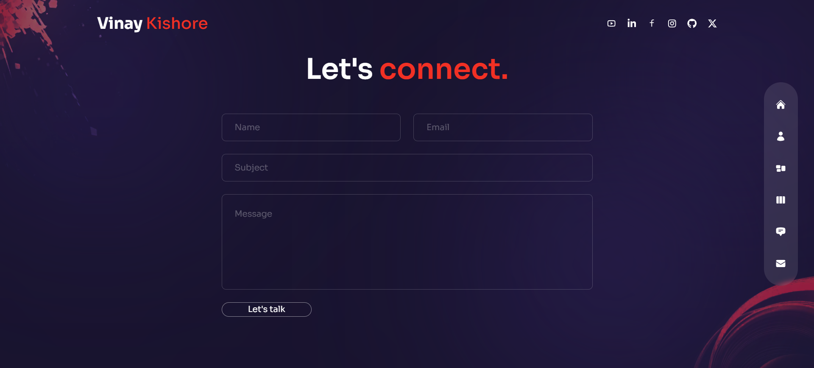

## Technologies
This web page was made with the following technologies:
- HTML5
- CSS3
- JavaScript
- React
- Next
- Framer Motion
- React Countup
- React DOM
- React Icons
- React tsParticles
- Swiper
- Tailwind CSS

## Pages
This project contains 6 sections: **Home**, **About**, **Services**, **Work**, **Testimonials** and **Contact**.

### Home
#### In that home section, On the right side there is a navigation bar that will take you to different sections of the website. And at the top right you will find the social networks.

 
### About
#### In that other section, you will see a title and a description. Below that you will see information such as Comprehensive expertise, Certified proficiencies, Finished projects, and awards won. On the right, you will see skills, awards, experience, credentials and education.

### Services
#### In this services section, there is a title and a short description. And on the right side the services offered to the client.

### Work
#### In this other section, you will see a title and a short description. Additionally, on the right side you will see the completed projects on various domains.

### Testimonials
#### In this section, you will see testimonials from mentors.

### Contact
#### In this other section, you will see a form which you can fill out to send a message and get in touch.

